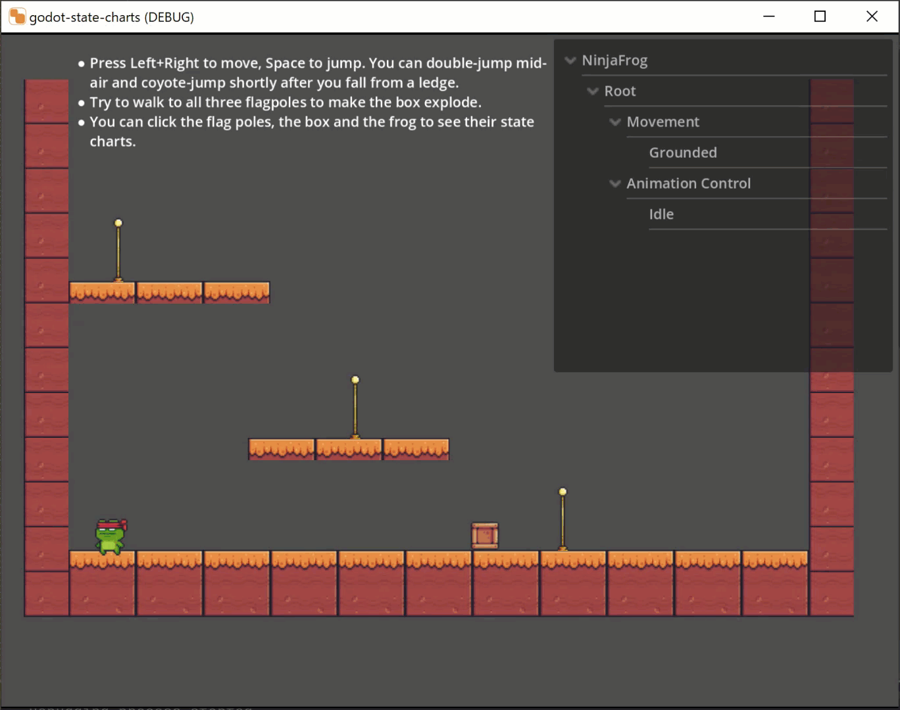

# Godot State Charts

_This library is still quite new and has not seen much use yet. While it works reasonably well, there may still be bugs and missing features. Please report any issues you find._

<!--suppress HtmlDeprecatedAttribute -->

## Quick Links

  <a href="https://godotengine.org/asset-library/asset/1778">Install from the Godot Asset Libary</a> | 
  <a href="manual/manual.md">Read the manual</a> |
  <a href="manual/faq.md">FAQ</a> |
  <a href="https://discord.gg/4JBkykG">Godot Engine Discord</a>

## What is Godot State Charts?

Godot State Charts is an extension for Godot Engine 4 or later that allows you to use [state charts](https://statecharts.dev) in your game. State Charts are similar to finite state machines, but they are more powerful and avoid the [state explosion](https://statecharts.dev/state-machine-state-explosion.html) problem of traditional FSMs. 

  

## Features

- Built from scratch for the Godot Engine in an idiomatic way using Godot's nodes and signals. You need very little code to get started.
- Your code only interacts with a single class, `StateChart` which has two methods for triggering transitions and setting properties for expression guards. There is no need to create subclasses or implement interfaces. This makes it easy to integrate the library into your existing code base (or remove it if you find it unsuitable).
- Declarative transitions with guards allow you to express complex logic in a simple way without writing any code.
- Transitions can be time-delayed to easily build things like cooldowns.
- Comprehensive in-editor error checking and warnings will help you avoid common mistakes.
- Inactive states will not update every frame for improved performance.
- All states adhere to the pause mode, so state charts will pause when the game is paused.
- Comprehensive documentation with a proper [manual](manual/manual.md) and annotated examples. 

### Attribution

The demo projects use the very nice [Pixel Adventure](https://pixelfrog-assets.itch.io/pixel-adventure-1) assets by [Pixel Frog](https://pixelfrog-assets.itch.io/). Thanks for making them available in the public domain!
