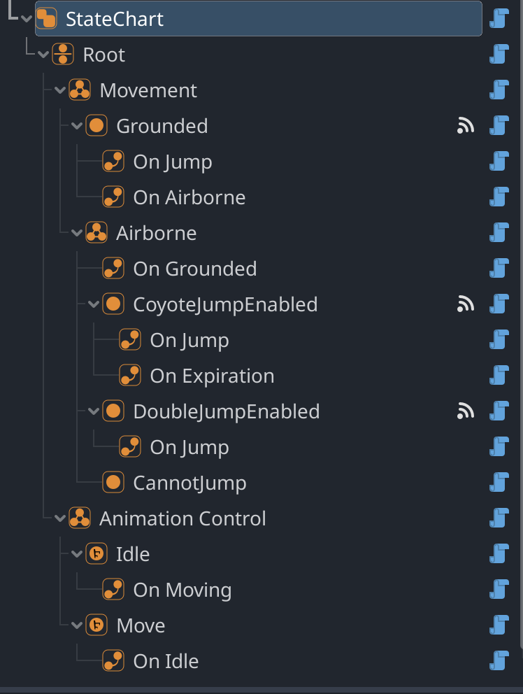

# Godot State Charts Manual

## Introduction

Godot State Charts is a plugin for Godot Engine that allows you to use state charts in your game. Now what is a state chart? [Statecharts.dev](https://statecharts.dev/) explains it like this:

> Put simply, a state chart is a beefed up state machine.  The beefing up solves a lot of the problems that state machines have, especially state explosion that happens as state machines grow.

## Installation

The easiest way to install the plugin is to use the Godot Asset Library. Search for "Godot State Charts" and install the plugin. You can also download a ZIP file of this repository and extract it, then copy the `addons/godot_state_charts` folder into your project's `addons` folder.

## Usage


The plugin adds a new node type called _State Chart_. This node is the root of your state chart. Below this node you can add the root state of your state chart, this will usually be a _Compound State_ or a _Parallel State_. You can add as many states as you want to your state chart, but you can only have one root state. Below each state you can add _Transition_ nodes. These nodes define the transitions between states. You can add as many transitions as you want to any state.



### The _State Chart_ node

The _State Chart_ node is your main way of interacting with the state charts. It allows you to send events to the state chart using the `send_event(event)` method. You can also set expression properties with the `set_expression_property(name, value)`  function, which can later be used by expression guards to determine whether a certain transition should be taken (see the section on expression guards for more information).


### States

States can be either active or inactive. On start the root state of the state chart will be activated. When a state has child states, one or more of these child states will be activated as well. States provide a range of signals which you can use to react to state changes or to execute code while the state is active. The following signals are available:

- `state_entered()` - this signal is emitted when the state is entered.
- `state_exited()` - this signal is emitted when the state is exited.
- `event_received(event)` - this signal is emitted when an event is received by the state while the state is active. The event is passed as a parameter.
- `state_processing(delta)` - this signal is emitted every frame while the state is active. The delta time is passed as a parameter. The signal will obey pause mode of the tree, so if the node is paused, this signal will not be emitted.
- `state_physics_processing(delta)` - this signal is emitted every physics frame while the state is active. The delta time is passed as a parameter. The signal will obey pause mode of the tree, so if the node is paused, this signal will not be emitted.

#### Atomic states

Atomic states are the most basic type of state. They cannot have child states and can either be active or inactive. Atomic states have no additional properties.

#### Compound states

Compound states are states which have at least one child state (though having at least two child states makes more sense). Only one child state of a compound state can be active at any given time. Compound states have the following properties:

- _Initial state_ - this property determines which child state will be activated when the compound state is entered directly. You can always activate a child state by explicitly transitioning to it. If you do not set an initial state then no child state will be activated and an error will be printed to the console.


#### Parallel states

Parallel states are similar to compound states in that they can have multiple child states. However, all child states of a parallel state are active at the same time when the parallel state is active. They allow you to model multiple states which are independent of each other. As such they are a great tool for avoiding combinatorial state explosion that you can get with simple state machines. Parallel states have no additional properties.

#### History states

History states are pseudo-states. They are not really a state but rather activate the last active state when being transitioned to. They can only be used as child states of compound states. They are useful when you temporarily want to leave a compound state and then return to the state you were in before you left. History states have the following properties:

- _Deep_ - if true the history state will capture and restore the state of the whole sub-tree below the compound state. If false the history state will only capture and restore the last active state of its immediate parent compound state.
- _Default state_ - this is the state which will be activated if the history state is entered and no history has been captured yet. If you do not set a default state, the history state will not activate any state when it is entered and an error will be printed to the console.


### Transitions

Transitions allow you to switch between states. Rather than directly switching the state chart to a certain state, you send events to the state chart. These events then trigger one or more transitions.  You can send events to the state chart by calling the `send_event(event)` method. 

The event will be passed to the active states going all the way down until a leaf state (a state which has no more child states) is reached. Now all transitions of that state will be checked, whether they react to that event. If a transition reacts to that event it will be queued for execution and the event is considered as handled. If no transition handles a given event, the event will bubble up to the parent state until it is consumed or reaches the root state. If the event reaches the root state and is not consumed, it will be ignored.

Transitions can execute immediately or after a certain time has elapsed. If a transition has no time delay it will be executed in the next frame after the event triggering it has been sent. If a transition has a time delay, it will be executed after the time delay has elapsed but only if the state to which the transition belongs is still active and was not left temporarily. Once a state is left, all transitions which were queued for execution will be discarded. There is one exception to this rule, when you are using history states. This is explained in more detail in the section on history states.

#### Transition guards

A transition can have a guard which determines whether the transition should be taken or not. If a transition reacts to an event the transition's guard will be evaluated. If the guard evaluates to `true` the transition will be taken. Otherwise the next transition which reacts to the event will be checked. If a transition has no guard, it will always be taken. Guards can be nested to create more complex guards. The following guards are available:

- _AllOfGuard_ - this guard evaluates to `true` if all of its child guards evaluate to `true` (logical AND).
- _AnyOfGuard_ - this guard evaluates to `true` if any of its child guards evaluate to `true` (logical OR).
- _NotGuard_ - this guard evaluates to the opposite of its child guard.
- _StateIsActiveGuard_ - this guard allows you to configure and monitor a state. The guard evaluates to `true` if the state is active and to `false` if the state is inactive.
- _ExpressionGuard_ - this guard allows you to use expressions to determine whether the transition should be taken or not. 

##### Expression guards
Expression guards give you the most flexibility when it comes to guards. You can use expressions to determine whether a transition should be taken or not. Expression guards are evaluated using the [Godot Expression](https://docs.godotengine.org/en/stable/classes/class_expression.html) class. You can add so-called _expression properties_ to the state chart node by calling the `set_expression_property(name, value)` method. 

```swift
@onready var state_chart: StateChart = $StateChart

func _ready():
    #// Add an expression property called "player_health" with the value 100
    state_chart.set_expression_property("player_health", 100)
```
These properties can then be used in your expressions. The following example shows how to use expression guards to check whether the player's health is below 50%:

